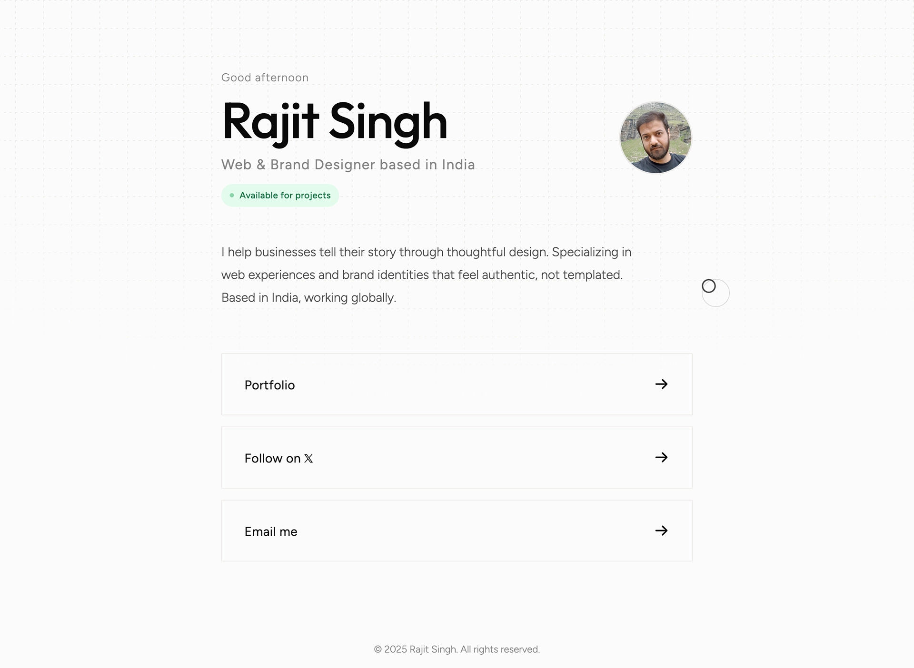

# Rajit Singh - Personal Portfolio

The personal portfolio website of Rajit Singh, a Web & Brand Designer based in India. The site follows a minimalist, "Swiss-style" design philosophy, with an emphasis on fluid typography, subtle micro-interactions, responsiveness, and performance.



## Key Features

### Design & UI

- **Minimalist Grid System**: A subtle dashed grid background with a radial mask and animated expansion on page load.
- **Fluid Typography**: Uses modern CSS `clamp()` functions to scale typography smoothly across screen sizes.
- **Dark/Light Theme**: Automatically adapts to the user's system preference using `prefers-color-scheme`.
- **Custom Cursor**: A custom JavaScript-driven cursor with a trailing follower and interactive hover effects on desktop devices.
- **Micro-interactions**: Subtle hover states, transitions, profile image scaling, animated availability indicator, and staged page entrance animations.

### Interactive Elements

- **Time-Aware Greeting**: Automatically displays "Good morning", "Good afternoon", or "Good evening" based on the visitor's local time.
- **Bento 404 Page**: A custom error page using a responsive CSS Grid "Bento" layout with a glitch-style 404 animation and return-to-home action.
- **Responsive Interactions**: Desktop-specific cursor effects are automatically disabled on touch devices.

### Technical Details

- **No Framework Dependencies**: Built with semantic HTML5, CSS3, and vanilla JavaScript. No frontend frameworks or build tools are required.
- **Performance Focused**: Designed as a lightweight static website with minimal client-side JavaScript and no build process.
- **Accessibility (A11y)**: Includes `prefers-reduced-motion` support to reduce or disable animations for users who prefer reduced motion.
- **Responsive Design**: Optimized for desktop, tablet, and mobile screen sizes.
- **SEO Optimized**: Includes canonical metadata, Open Graph and Twitter Card tags, XML sitemap, `robots.txt`, and Schema.org `Person` structured data.

## Development

This is a static website, so no build process or package installation is required.

### Clone the repository

```bash
git clone git@github.com:rajit-singh/rajit.xyz.git
cd rajit.xyz
```
### Run locally

Simply open `index.html` in a web browser.

Alternatively, serve the directory using any local static file server.

## Project Structure

```text
├── index.html
├── 404.html
├── robots.txt
├── sitemap.xml
├── css/
│   └── styles.css
├── js/
│   └── scripts.js
└── images/
```

## License

© 2026 Rajit Singh. All rights reserved.